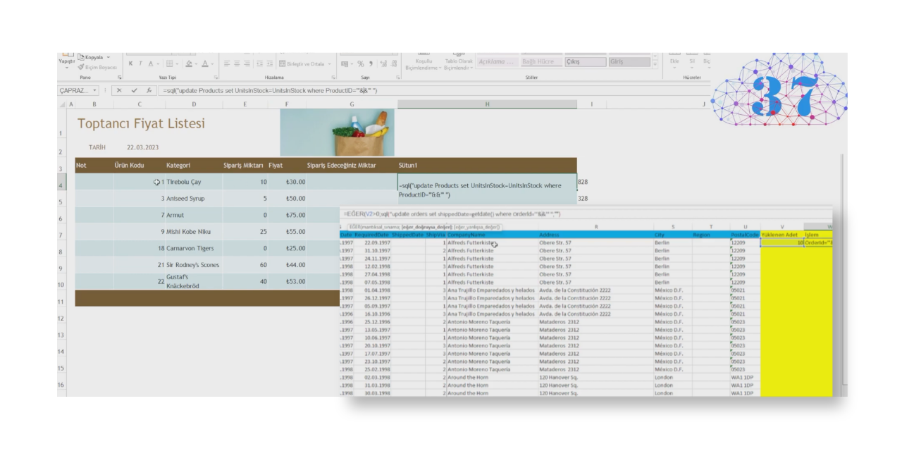

# 🌍 Deprem İlerleme Animasyonu (Chrome Eklentisi)

Kandilli Rasathanesi tarafından yayınlanan son depremleri web sayfalarında animasyonlu olarak görüntüleyen Chrome eklentisi.

<p align="center">
  
</p>

<p align="center">
  Son depremleri harita üzerinde animasyonlu olarak takip edin.
</p>

---

# 🇬🇧 English

Earthquake Progress Animation is a Chrome extension that retrieves earthquake data published by Kandilli Observatory and visualizes earthquakes with animated effects directly on supported web pages.

The extension helps users quickly identify the location, magnitude, and recency of earthquakes through visual animations.

---

# 🇹🇷 Türkçe

Deprem İlerleme Animasyonu, Kandilli Rasathanesi tarafından yayınlanan son deprem verilerini alarak desteklenen web sayfalarında animasyonlu şekilde gösteren bir Chrome eklentisidir.

Depremlerin;

* Konumlarını
* Büyüklüklerini
* Zaman bilgilerini
* Etki alanlarını

görsel animasyonlarla takip etmenizi sağlar.

---

# ✨ Özellikler

✅ Kandilli Rasathanesi deprem verileri

✅ Chrome eklentisi

✅ Animasyonlu deprem gösterimi

✅ Gerçek zamanlı veri güncelleme

✅ Hafif ve hızlı çalışma

✅ Otomatik veri çekme

✅ Görsel deprem işaretleri

✅ Kolay kurulum

---

# 📸 Ekran Görüntüleri

## Ana Görünüm


---

# 📂 Proje İçeriği

| Dosya                        | Açıklama                 |
| ---------------------------- | ------------------------ |
| manifest.json                | Chrome eklenti tanımları |
| background.js                | Arka plan işlemleri      |
| popup.html                   | Eklenti arayüzü          |
| popup.js                     | Popup işlemleri          |
| page.js                      | Sayfa entegrasyonu       |
| page.css                     | Sayfa stilleri           |
| popup.css                    | Popup stilleri           |
| script2.js                   | Yardımcı scriptler       |
| depremIlerlemeAnimasyonu.zip | Paketlenmiş sürüm        |

---

# 🚀 Kurulum

## Geliştirici Modu ile Kurulum

1. Chrome tarayıcısını açın.
2. Adres satırına aşağıdaki adresi yazın:

```text
chrome://extensions
```

3. Sağ üstten **Geliştirici Modu** seçeneğini aktif edin.
4. **Paketlenmemiş öğe yükle** butonuna tıklayın.
5. Bu proje klasörünü seçin.
6. Eklenti kullanıma hazırdır.

---

# 📡 Veri Kaynağı

Bu proje deprem verilerini Kandilli Rasathanesi tarafından yayınlanan verilerden almaktadır.

Verilerin doğruluğu ve güncelliği ilgili kurumun yayınlarına bağlıdır.

---

# ⚠️ Uyarı

Bu eklenti yalnızca bilgilendirme amacıyla geliştirilmiştir.

Acil durumlarda ve resmi açıklamalarda;

* AFAD
* Kandilli Rasathanesi
* Yetkili kurumların

duyuruları esas alınmalıdır.

---

# 🛠 Teknolojiler

* JavaScript
* HTML5
* CSS3
* Chrome Extension API

---

# 📜 Lisans

MIT License
