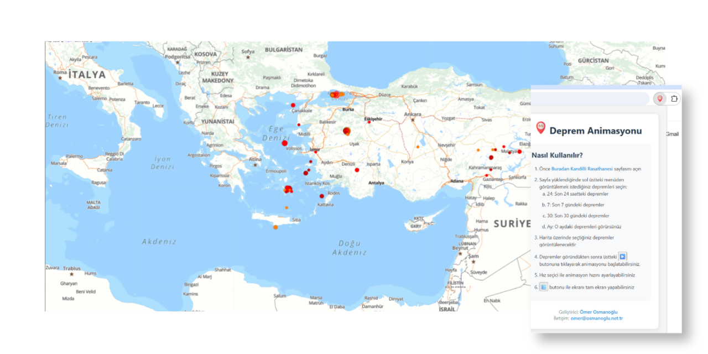

# 🌍 Deprem İlerleme Animasyonu (Chrome Eklentisi)

Kandilli Rasathanesi tarafından yayınlanan son depremleri web sayfalarında animasyonlu olarak görüntüleyen Chrome eklentisi.

<p align="center">
  
</p>

<a href='https://chromewebstore.google.com/detail/deprem-i%CC%87lerleme-animasyo/okeiloiifndjmajnbmccmbacoancocpg'>
Eklentiyi kurmak için tıklayın</a>


<p align="center">
  Son depremleri harita üzerinde animasyonlu olarak takip edin.
</p>

---

# 🇬🇧 English

Earthquake Progress Animation is a Chrome extension that retrieves earthquake data published by Kandilli Observatory and visualizes earthquakes with animated effects directly on supported web pages.

The extension helps users quickly identify the location, magnitude, and recency of earthquakes through visual animations.

---

# 🇹🇷 Türkçe

Deprem İlerleme Animasyonu, Kandilli Rasathanesi tarafından yayınlanan son deprem verilerini alarak desteklenen web sayfalarında animasyonlu şekilde gösteren bir Chrome eklentisidir.

Depremlerin;

* Konumlarını
* Büyüklüklerini
* Zaman bilgilerini
* Etki alanlarını

görsel animasyonlarla takip etmenizi sağlar.

---

# ✨ Özellikler

✅ Kandilli Rasathanesi deprem verileri

✅ Chrome eklentisi

✅ Animasyonlu deprem gösterimi

✅ Gerçek zamanlı veri güncelleme

✅ Hafif ve hızlı çalışma

✅ Otomatik veri çekme

✅ Görsel deprem işaretleri

✅ Kolay kurulum

---

# 📸 Ekran Görüntüleri

## Ana Görünüm


---

# 📂 Proje İçeriği

| Dosya                        | Açıklama                 |
| ---------------------------- | ------------------------ |
| manifest.json                | Chrome eklenti tanımları |
| background.js                | Arka plan işlemleri      |
| popup.html                   | Eklenti arayüzü          |
| popup.js                     | Popup işlemleri          |
| page.js                      | Sayfa entegrasyonu       |
| page.css                     | Sayfa stilleri           |
| popup.css                    | Popup stilleri           |
| script2.js                   | Yardımcı scriptler       |
| depremIlerlemeAnimasyonu.zip | Paketlenmiş sürüm        |

---

# 🚀 Kurulum

## Geliştirici Modu ile Kurulum

1. Chrome tarayıcısını açın.
2. Adres satırına aşağıdaki adresi yazın:

```text
chrome://extensions
```

3. Sağ üstten **Geliştirici Modu** seçeneğini aktif edin.
4. **Paketlenmemiş öğe yükle** butonuna tıklayın.
5. Bu proje klasörünü seçin.
6. Eklenti kullanıma hazırdır.

---

# 📡 Veri Kaynağı

Bu proje deprem verilerini Kandilli Rasathanesi tarafından yayınlanan verilerden almaktadır.

Verilerin doğruluğu ve güncelliği ilgili kurumun yayınlarına bağlıdır.

---

# ⚠️ Uyarı

Bu eklenti yalnızca bilgilendirme amacıyla geliştirilmiştir.

Acil durumlarda ve resmi açıklamalarda;

* AFAD
* Kandilli Rasathanesi
* Yetkili kurumların

duyuruları esas alınmalıdır.

---

# 🛠 Teknolojiler

* JavaScript
* HTML5
* CSS3
* Chrome Extension API

---


---

# 🌐 Chrome Web Store'da Yayınlama

Bu proje açık kaynak olarak paylaşılmıştır. Eklentiyi kendi hesabınız üzerinden Chrome Web Store'da yayınlamak isterseniz aşağıdaki adımları izleyebilirsiniz.

## 1. Paketlenmiş Sürümü Hazırlayın

Chrome eklenti klasörünün içeriğini ZIP dosyası haline getirin.

ZIP dosyasının kök dizininde aşağıdaki dosyalar bulunmalıdır:

```text
manifest.json
background.js
popup.html
popup.js
page.js
page.css
popup.css
images/
```

> Not: `manifest.json` dosyası ZIP içerisinde en üst seviyede bulunmalıdır.

## 2. Chrome Web Store Geliştirici Paneline Girin

Aşağıdaki adrese gidin:

https://chrome.google.com/webstore/devconsole/

Google hesabınız ile giriş yapın.

## 3. Yeni Eklenti Oluşturun

- "New Item" veya "Add New Item" seçeneğine tıklayın.
- Hazırladığınız ZIP dosyasını yükleyin.

## 4. Mağaza Bilgilerini Girin

Aşağıdaki bilgileri doldurun:

### Eklenti Adı

```text
Örnek: Deprem İlerleme Animasyonu
```

### Kısa Açıklama

```text
Örnek: Kandilli Rasathanesi verilerini animasyonlu olarak görüntüleyen Chrome eklentisi.
```

### Ayrıntılı Açıklama

README dosyasındaki açıklamaları kullanabilirsiniz.

## 5. Görselleri Yükleyin

Önerilen görseller:

- Eklenti ekran görüntüleri
- Popup ekranı
- Animasyon görünümü
- Banner görseli

## 6. Gizlilik Politikası

Eğer eklenti herhangi bir kullanıcı verisi toplamıyor ise açıklama kısmında bunu belirtmeniz önerilir.

Örnek:

```text
Örnek: Bu eklenti herhangi bir kişisel veri toplamaz, saklamaz veya üçüncü taraflarla paylaşmaz.
```

## 7. İnceleme İçin Gönderin

Tüm bilgileri doldurduktan sonra:

```text
Submit for Review
```

butonuna tıklayarak Google inceleme sürecini başlatabilirsiniz.

Google onayından sonra eklenti Chrome Web Store'da yayınlanacaktır.

---

# ⚠️ Sorumluluk Reddi

Bu proje eğitim ve bilgilendirme amaçlı geliştirilmiştir.

Chrome eklentisi nasıl geliştirilir onu deneyimlemeniz için yayınlanmıştır.

Deprem verileri ilgili veri kaynaklarından alınmaktadır. Acil durumlarda AFAD, Kandilli Rasathanesi ve resmi kurumların duyuruları esas alınmalıdır.


# 📜 Lisans

MIT License
